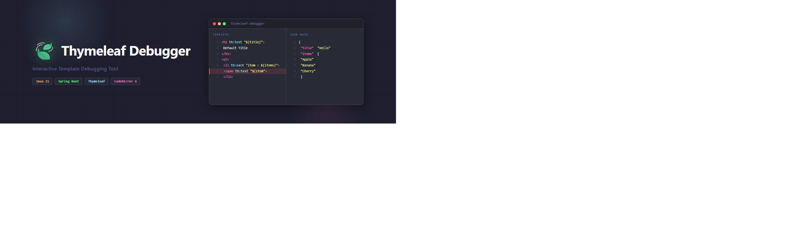

<p align="center">
  
</p>

<p align="center">
  <strong>Interactive Thymeleaf Template Debugging Tool</strong><br>
  <strong>交互式 Thymeleaf 模板调试工具</strong>
</p>

<p align="center">
  
  
  
  
  
</p>

<p align="center">
  <a href="#-introduction">English</a> | <a href="#-简介">中文</a>
</p>

---

## 🍃 Introduction

**Thymeleaf Debugger** is a web-based developer tool for interactively debugging Thymeleaf templates.

Debugging Thymeleaf templates usually means restarting the app, refreshing the browser, and scrolling through logs. This tool puts the template editor, data input, and rendered output all on one page — with live preview and pinpoint error highlighting.

## 🍃 简介

**Thymeleaf Debugger** 是一个面向开发者的 Web 工具，用于交互式调试 Thymeleaf 模板。

在日常开发中，调试 Thymeleaf 模板往往需要反复启动项目、刷新页面、查看日志。这个工具将模板编辑、数据注入和渲染结果集中在一个页面上，支持实时预览和精准的错误定位，大幅提升调试效率。

---

## ✨ Features / 特性

| | English | 中文 |
|---|---|---|
| 🖥️ | **Three-panel layout** — Template editor + JSON editor + output | **三栏布局** — 模板编辑器 + JSON 数据编辑器 + 渲染结果 |
| ⚡ | **Live rendering** — One-click or `Ctrl+Enter` | **实时渲染** — 一键渲染 / `Ctrl+Enter` 快捷键 |
| 🎯 | **Precise error location** — Click error to jump to the offending line | **精准错误定位** — 点击错误信息跳转到出错行 |
| 🎨 | **Code formatting** — JSON / HTML with `Shift+Alt+F` | **代码格式化** — JSON / HTML 一键格式化 |
| 🌙 | **Dark theme** — Dracula-inspired, easy on the eyes | **暗色主题** — Dracula 风格，长时间使用不疲劳 |
| 📝 | **Syntax highlighting** — CodeMirror 6 for HTML & JSON | **语法高亮** — HTML 和 JSON 专业高亮 |
| 👀 | **Dual view** — Switch between HTML preview and source | **双视图** — HTML 预览和源码切换 |

---

## 📋 Prerequisites / 环境要求

| Dependency | Version | Note |
|------------|---------|------|
| **Java** | 21+ | JDK (not JRE) |
| **Maven** | 3.8+ | Build tool |

> 💡 Recommended: [BellSoft Liberica JDK 21](https://bell-sw.com/pages/downloads/) or [Eclipse Temurin 21](https://adoptium.net/)

---

## 🚀 Quick Start / 快速开始

### 1. Clone / 克隆

```bash
git clone https://github.com/Henry-G-H-Huang/thymeleaf-debugger.git
cd thymeleaf-debugger
```

### 2. Run / 启动

**Dev mode** (compile + start in one step / 编译+启动一步到位):

```bash
dev.bat
```

Or step by step / 或者分步操作:

```bash
# Compile only / 仅编译
build.bat

# Start only (skip compile) / 仅启动（跳过编译）
start.bat
```

### 3. Use / 使用

The browser opens automatically at `http://localhost:8080`.  
If port 8080 is in use, it auto-tries 8081–8099.

浏览器会自动打开 `http://localhost:8080`。若端口被占用，自动尝试 8081–8099。

---

## 📖 Usage Guide / 使用指南

### Workflow / 工作流

1. **Left panel** — Write your Thymeleaf template / 编写 Thymeleaf 模板
2. **Right panel** — Enter JSON context data / 输入 JSON 上下文数据
3. **Click Render** — Or press `Ctrl+Enter` / 点击"渲染"或按 `Ctrl+Enter`
4. **View result** — Toggle between HTML preview and source / 切换预览与源码

### Keyboard Shortcuts / 快捷键

| Shortcut | Action |
|----------|--------|
| `Ctrl+Enter` | Render template / 渲染模板 |
| `Shift+Alt+F` | Format current editor / 格式化当前编辑器 |

### Error Handling / 错误处理

When a template has syntax errors / 当模板存在语法错误时:

- Error details shown in the output panel / 底部面板显示错误详情
- Offending line highlighted in **red** / 出错行**红色高亮**
- **Click the error** to jump to the exact line / **点击错误信息**跳转到出错位置

### Example / 示例

**Template** (left panel / 左侧面板):
```html
<h1 th:text="${title}">Default</h1>
<ul>
    <li th:each="item : ${items}" th:text="${item}">Item</li>
</ul>
```

**JSON Data** (right panel / 右侧面板):
```json
{
  "title": "Hello World",
  "items": ["Apple", "Banana", "Cherry"]
}
```

---

## 🏗️ Tech Stack / 技术栈

| Layer | Technology |
|-------|-----------|
| Backend | Spring Boot 3.4 + Thymeleaf 3.1 (standalone engine) |
| Editor | CodeMirror 6 (via esm.sh CDN) |
| Formatter | js-beautify (HTML) + native JSON.stringify (JSON) |
| Build | Maven |

---

## 📁 Project Structure / 项目结构

```
thymeleaf-debugger/
├── pom.xml                          # Maven config
├── build.bat                        # Compile only / 仅编译
├── start.bat                        # Start server (auto port) / 启动（自动换端口）
├── dev.bat                          # Compile + Start / 编译+启动
├── src/main/
│   ├── java/.../debugger/
│   │   ├── ThymeleafDebuggerApplication.java   # Entry point / 入口
│   │   ├── controller/
│   │   │   └── TemplateController.java         # REST API
│   │   ├── service/
│   │   │   └── TemplateService.java            # Template engine / 模板引擎
│   │   └── dto/
│   │       ├── RenderRequest.java              # Request DTO
│   │       └── RenderResponse.java             # Response DTO
│   └── resources/
│       ├── application.yml
│       └── static/
│           ├── index.html                      # Main page / 主页面
│           ├── app.css                         # Styles / 样式
│           └── app.js                          # Frontend logic / 前端逻辑
└── docs/
    └── banner.png                              # README banner
```

---

## 🔌 API

### POST `/api/render`

Render a Thymeleaf template / 渲染 Thymeleaf 模板。

**Request / 请求体**:
```json
{
  "template": "<h1 th:text=\"${title}\">Default</h1>",
  "data": "{\"title\": \"Hello\"}"
}
```

**Success response / 成功响应**:
```json
{
  "success": true,
  "output": "<h1>Hello</h1>",
  "errors": []
}
```

**Error response / 错误响应**:
```json
{
  "success": false,
  "output": null,
  "errors": [
    {
      "message": "Could not parse as expression...",
      "line": 3,
      "col": 15
    }
  ]
}
```

---

## 📄 License

[MIT](LICENSE)
